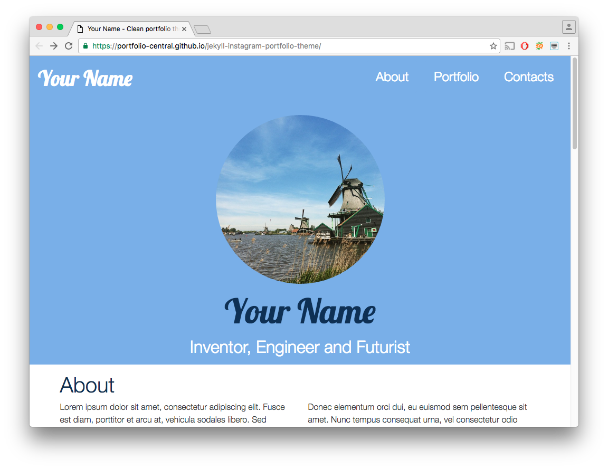

# Jekyll Instagram Portfolio Theme

Clean, minimalistic and responsive portfolio theme for Jekyll powered by Bootstrap 4.
For the portfolio section is used Instagram widget, but you can easily update it with another content source.

## Live Demo

https://portfolio-central.github.io/jekyll-instagram-portfolio-theme/


## Showcase

The best usage examples:

- [Pavel Guzenko](http://guzenko.org.ua)
- [Victor Mikitenko](https://mikitenko-org-ua.github.io/site/)
- [Anthony Fuentes](http://anthonyfuentes.us/)
- [Serhii Grytsyshyn](https://grserhii.github.io/)

To add your example: fork the repo, add new line to the list above and create a pull request.

## Featured on

- [Template.net](https://www.template.net/cms-templates/jekyll/jekyll-themes-templates/)
- [JekyllThemes.org](http://jekyllthemes.org/themes/instagram-portfolio-theme/)

## Powered by

- [Jekyll](https://jekyllrb.com/)
- [Bootstrap 4](http://v4-alpha.getbootstrap.com/)
- [jQuery](https://jquery.com/)
- [SnapWidget](https://snapwidget.com)
- [Google Fonts: Lobster](https://fonts.google.com/specimen/Lobster)
- [Font Awesome](http://fontawesome.io/)

## Installation
Install Jekyll:

```
gem install jekyll bundler
```

Install bundle dependiencies:

```
bundle install
```

When finished, run the dev server:

```
bundle exec jekyll serve
```

or just:

```
jekyll serve

```
To stop the server, use `CTRL+C`.

## Building front-end assets: styles and scripts

Install module dependencies:

```
npm install
```

Run the build script to generate updated front-end assets:

```
npm run build
```

Watch for changes and automatically rebuild assets (`CTRL+C` to stop):
```
npm run watch
```
